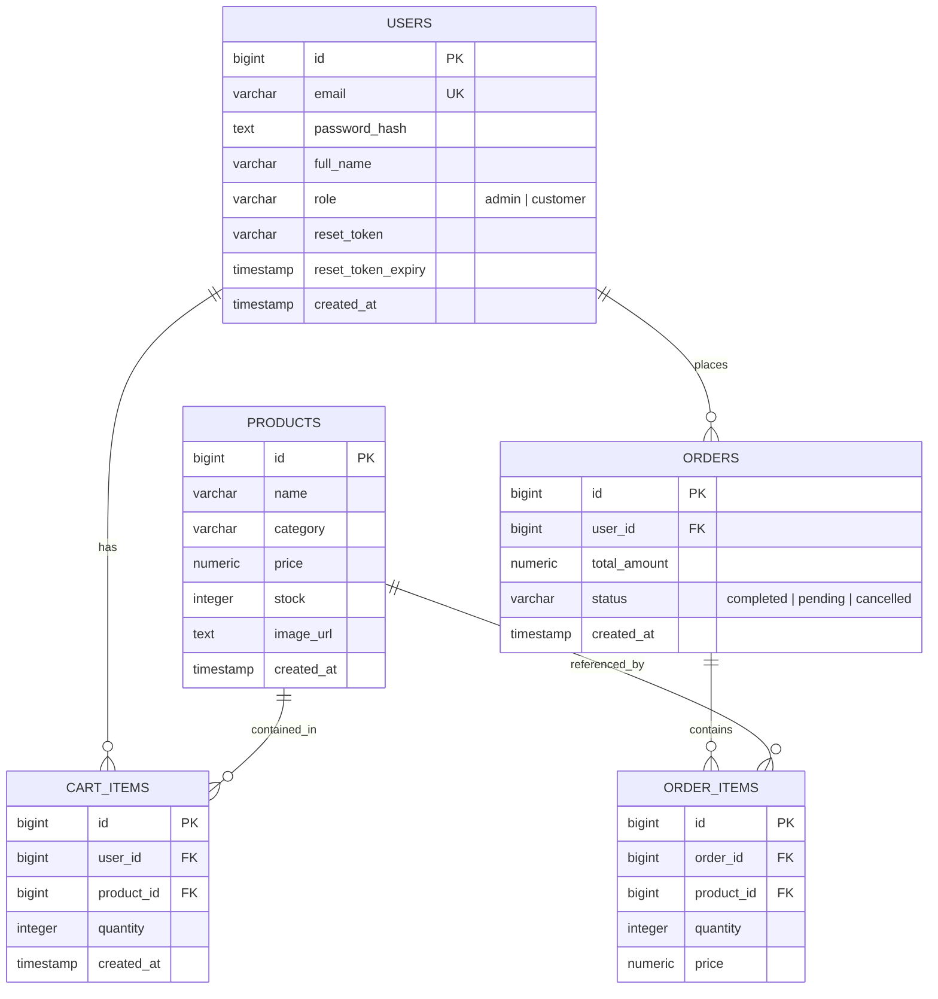

# 🗄️ Database ERD - Bestarion Shopping Application

## Entity Relationship Diagram

---

## Database Table Descriptions

| Table Name     | Primary Key | Key Columns & Constraints                                                                             | Description                                                                     |
| -------------- | ----------- | ----------------------------------------------------------------------------------------------------- | ------------------------------------------------------------------------------- |
| **`users`**    | `id`        | `email` (UNIQUE), `password_hash`, `full_name`, `role` ('admin' \| 'customer', default: 'customer')   | Stores user accounts, bcrypt hashed passwords, roles, and reset tokens. Note: Registering with `admin@gmail.com` grants `admin` role. |
| **`products`** | `id`        | `name`, `category`, `price`, `stock`, `image_url`                                                     | Stores product catalog items. `image_url` stores static path to uploaded files saved in `./uploads/`. |
| **`cart_items`**| `id`       | `user_id` (FK -> users.id), `product_id` (FK -> products.id), `quantity`                              | Stores active shopping cart items for logged-in users.                          |
| **`orders`**   | `id`        | `user_id` (FK -> users.id), `total_amount`, `status` ('completed' \| 'pending' \| 'cancelled')         | Stores completed purchase orders and transaction totals.                        |
| **`order_items`**| `id`      | `order_id` (FK -> orders.id), `product_id` (FK -> products.id), `quantity`, `price`                   | Stores historical snapshot of items, quantities, and prices per order.          |

---

## Entity Relationships

1. **`USERS` ↔ `CART_ITEMS`**: One-to-Many. A user can have multiple product items in their shopping cart.
2. **`PRODUCTS` ↔ `CART_ITEMS`**: One-to-Many. A product can be added to multiple user carts.
3. **`USERS` ↔ `ORDERS`**: One-to-Many. A user can place multiple orders over time.
4. **`ORDERS` ↔ `ORDER_ITEMS`**: One-to-Many. An order consists of multiple order item records.
5. **`PRODUCTS` ↔ `ORDER_ITEMS`**: One-to-Many. Historical reference connecting order line items back to the product.

---

## Database Migration & Persistent Storage Strategy

1. **Auto-migrations**: Schema table creation is handled inside constructor functions (`NewProductRepository`, `NewUserRepository`, `NewShoppingRepository`) via `CREATE TABLE IF NOT EXISTS ...` and `ALTER TABLE ... ADD COLUMN IF NOT EXISTS ...`.
2. **Data Persistence**:
   * PostgreSQL table data is persisted via Docker volume `postgres_data`.
   * Uploaded local product images are saved locally to `./shopping-backend/uploads` and persisted via Docker volume mount `./shopping-backend/uploads:/app/uploads`.
